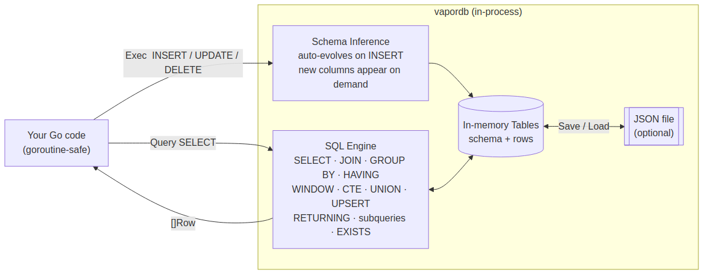

# vapordb

In-memory SQL database for fast prototyping in Go - no setup, no schema, just queries

When building something new, the data model changes constantly. With a real database every field addition, rename, or type change requires a migration script, an ALTER TABLE, and a re-run of your seed data. That friction compounds quickly and slows you down at exactly the stage where you need to move fast.

vapordb removes that entirely. You just write code. Change a struct, add a column to an INSERT, and the schema updates itself. There is nothing to migrate, nothing to roll back, and no mismatch between your code and your database to debug. You stay focused on the logic and the shape of the data rather than the mechanics of keeping a schema in sync.

The result is full SQL with joins, aggregates, CASE, LIKE, BETWEEN. Enough to work with your data properly while you design. Once the data model stabilises and you are ready to commit to a real database, you write the CREATE TABLE and migrations once, with full knowledge of what you actually need.

```go
db := vapordb.New()
db.Exec(`INSERT INTO users (id, name, age) VALUES (1, 'Alice', 30)`)

rows, _ := db.Query(`SELECT name FROM users WHERE age > 25`)
```



## Features

- **Zero setup.** No CREATE TABLE, no migrations. Schema is inferred from the first INSERT.
- **Automatic schema evolution.** New columns are added on the fly. Safe type widening (e.g. `int` to `float`) happens automatically.
- **SQL you already know.** SELECT, INSERT, UPDATE, DELETE with WHERE, JOIN, GROUP BY, ORDER BY, LIMIT, HAVING.
- **Rich expressions.** Aggregates, scalar functions, CASE, BETWEEN, IN, LIKE, arithmetic, and more.
- **UPSERT.** `ON CONFLICT (col) DO UPDATE SET …` and `ON CONFLICT (col) DO NOTHING`. Composite conflict keys and batch-value inserts are supported.
- **Window functions.** `ROW_NUMBER()`, `RANK()`, `DENSE_RANK()`, `COUNT(*)`, `SUM`, `AVG`, `MIN`, `MAX` with `OVER([PARTITION BY …] [ORDER BY …])`.
- **`RETURNING` clause.** Append `RETURNING col1, col2` (or `RETURNING *`) to any `INSERT`, `UPDATE`, or `DELETE` and call `db.Query(…)` to get back the affected rows. For INSERT the returned rows are the newly inserted rows. For UPDATE the rows are in their post-update state. For DELETE the rows are in their pre-deletion state.
- **CTEs (`WITH … AS (…) SELECT …`).** One or more named subqueries before the main SELECT. Later CTEs can reference earlier ones. CTE names act as virtual tables for the main query, `JOIN`s, `EXISTS` subqueries, and derived tables.
- **`UNION` / `UNION ALL`.** Combine result sets from multiple SELECTs, with optional `ORDER BY` / `LIMIT` on the combined result.
- **Subqueries in `FROM`.** `SELECT … FROM (SELECT …) AS sub` — derived tables, including joins against derived tables and nested subqueries.
- **`SELECT EXISTS (subquery)`.** Correlated and uncorrelated, in `WHERE` and as a projected column.
- **Date support.** `KindDate` type backed by `time.Time`. Date literals, comparisons, BETWEEN, ORDER BY, and date functions (NOW, CURDATE, DATE, YEAR, MONTH, DAY, DATEDIFF, DATE_ADD, DATE_FORMAT, …). String literals auto-coerce when compared against date columns.
- **Named parameters.** `:param` placeholders in any SQL statement via `db.QueryNamed` / `db.ExecNamed`. Accepts `map[string]any` or a `db`-tagged struct. Slice values expand automatically, so `= ANY(:ids)` with `[]int{1,2,3}` becomes `IN (1, 2, 3)`.
- **Struct mapping.** Insert from structs and scan results back into typed slices via `db` tags. Pointer fields, `sql.NullString` / `sql.Null*`, `fmt.Stringer`, `encoding.TextUnmarshaler`, and custom `driver.Valuer` / `sql.Scanner` types all round-trip automatically.
- **Enum constraints.** `db.DeclareEnum(table, col, vals...)` restricts a column to a declared set of string values. INSERTs and UPDATEs that supply a value outside the set are rejected with an error. Calling `DeclareEnum` again on the same column widens the set (new variants are added; existing ones are never removed). NULL is always accepted. Constraints survive `Save` / `Load`.
- **Optional persistence.** Save the entire database to a JSON file and reload it later.

## Installation

```bash
go get github.com/flyingraptor/vapordb
```

## Quick Start

```go
package main

import (
    "fmt"
    "github.com/flyingraptor/vapordb"
)

func main() {
    db := vapordb.New()

    db.Exec(`INSERT INTO users (id, name, age) VALUES (1, 'Alice', 30)`)
    db.Exec(`INSERT INTO users (id, name, age) VALUES (2, 'Bob',   25)`)
    db.Exec(`INSERT INTO users (id, name, age) VALUES (3, 'Carol', 28)`)

    rows, _ := db.Query(`SELECT name, age FROM users WHERE age >= 28 ORDER BY age DESC`)
    for _, r := range rows {
        fmt.Printf("%s is %v\n", r["name"].V, r["age"].V)
    }
    // Carol is 28
    // Alice is 30
}
```

## Core API

| Method | Description |
|--------|-------------|
| `vapordb.New()` | Create a new empty database |
| `db.Exec(sql)` | Run INSERT, UPDATE, or DELETE |
| `db.Query(sql)` | Run SELECT, returns `[]Row` |
| `db.Save(path)` | Persist the database to a JSON file |
| `db.Load(path)` | Load a previously saved JSON file |
| `db.InsertStruct(table, v)` | Insert a struct using `db` field tags |
| `vapordb.ScanRows[T](rows)` | Scan `[]Row` into a typed slice |
| `db.QueryNamed(sql, params)` | SELECT with named `:param` placeholders |
| `db.ExecNamed(sql, params)` | INSERT/UPDATE/DELETE with named `:param` placeholders |
| `db.DeclareEnum(table, col, vals...)` | Restrict a column to a fixed set of string values |

A `Row` is `map[string]Value`. Each `Value` has:
- `.V` is the underlying Go value (`int64`, `float64`, `string`, `bool`, `time.Time`, or `nil`)
- `.Kind` is one of `KindNull`, `KindBool`, `KindInt`, `KindFloat`, `KindString`, `KindDate`

## Schema Inference

You never define a schema. vapordb infers it from the data:

```go
db.Exec(`INSERT INTO events (id, name) VALUES (1, 'launch')`)
// schema: {id: Int, name: String}

db.Exec(`INSERT INTO events (id, name, score) VALUES (2, 'beta', 9.5)`)
// schema: {id: Int, name: String, score: Float}
// previous row gets score = NULL automatically
```

Type widening is safe and automatic (`bool` to `int` to `float`). Crossing into a different family (e.g. a column that was `int` now receives a `string`) wipes the table and starts fresh with the new type.

## Struct Mapping

Tag your structs with `db` and use the built-in helpers:

```go
type Product struct {
    ID    int     `db:"id"`
    Name  string  `db:"name"`
    Price float64 `db:"price"`
}

// insert
db.InsertStruct("products", Product{1, "Widget", 9.99})
db.InsertStruct("products", Product{2, "Gadget", 24.50})

// query back into typed slice
rows, _ := db.Query(`SELECT id, name, price FROM products ORDER BY price`)
products := vapordb.ScanRows[Product](rows)
```

NULL columns are mapped to the field's zero value (`0`, `""`, `false`).

### Pointer fields

Pointer fields map NULL to `nil` and non-NULL to an allocated value:

```go
type User struct {
    ID    int     `db:"id"`
    Name  string  `db:"name"`
    Bio   *string `db:"bio"`   // NULL when not set
}

bio := "Go enthusiast"
db.InsertStruct("users", User{ID: 1, Name: "Alice", Bio: &bio})
db.InsertStruct("users", User{ID: 2, Name: "Bob"})   // Bio is nil → NULL

rows, _ := db.Query(`SELECT id, name, bio FROM users ORDER BY id`)
users := vapordb.ScanRows[User](rows)
// users[0].Bio  →  &"Go enthusiast"
// users[1].Bio  →  nil
```

### sql.NullString and sql.Null* types

The standard `database/sql` nullable types work out of the box via the `driver.Valuer` / `sql.Scanner` interfaces:

```go
type Order struct {
    ID      int            `db:"id"`
    Note    sql.NullString `db:"note"`    // nullable string
    Qty     sql.NullInt64  `db:"qty"`     // nullable int
}

db.InsertStruct("orders", Order{
    ID:   1,
    Note: sql.NullString{String: "urgent", Valid: true},
    Qty:  sql.NullInt64{Int64: 3, Valid: true},
})
db.InsertStruct("orders", Order{
    ID:   2,
    Note: sql.NullString{Valid: false},   // → NULL
    Qty:  sql.NullInt64{Valid: false},    // → NULL
})

rows, _ := db.Query(`SELECT id, note, qty FROM orders ORDER BY id`)
orders := vapordb.ScanRows[Order](rows)
// orders[1].Note.Valid  →  false
```

### Custom types (driver.Valuer / sql.Scanner)

Any type implementing both interfaces round-trips automatically:

```go
type Status string

func (s Status) Value() (driver.Value, error) { return string(s), nil }
func (s *Status) Scan(src any) error {
    if v, ok := src.(string); ok { *s = Status(v) }
    return nil
}

type Task struct {
    ID     int    `db:"id"`
    Status Status `db:"status"`
}

db.InsertStruct("tasks", Task{ID: 1, Status: "open"})
tasks := vapordb.ScanRows[Task](mustQuery(db, `SELECT id, status FROM tasks`))
// tasks[0].Status  →  "open"
```

Types implementing `fmt.Stringer` and `encoding.TextUnmarshaler` (such as `net.IP` or `uuid.UUID`) also round-trip without any extra code.

## Named Parameters

Use `:name` placeholders instead of inlining values into SQL strings. Pass either a `map[string]any` or a struct with `db` tags.

```go
// map
rows, err := db.QueryNamed(
    `SELECT * FROM orders WHERE user_id = :uid AND status = :status`,
    map[string]any{"uid": 42, "status": "open"},
)

// struct
type Filter struct {
    MinAge int    `db:"min"`
    MaxAge int    `db:"max"`
}
rows, err = db.QueryNamed(
    `SELECT name FROM users WHERE age BETWEEN :min AND :max`,
    Filter{MinAge: 25, MaxAge: 35},
)

// insert
err = db.ExecNamed(
    `INSERT INTO users (id, name, age) VALUES (:id, :name, :age)`,
    map[string]any{"id": 5, "name": "Eve", "age": 28},
)
```

Single-quoted string literals in the SQL are never scanned for placeholders, so values like `WHERE note = ':not_a_param'` are safe. Single quotes inside string values are automatically escaped.

Slice values expand to a comma-separated literal list, making them ideal with `= ANY(:param)` / `<> ALL(:param)`:

```go
db.QueryNamed(
    `SELECT * FROM orders WHERE id = ANY(:ids)`,
    map[string]any{"ids": []int{10, 20, 30}},
)
// expands to: WHERE id IN (10, 20, 30)
```

## Persistence

```go
// save at any point
db.Save("/var/data/myapp.json")

// load on next startup
db := vapordb.New()
if err := db.Load("/var/data/myapp.json"); err != nil && !errors.Is(err, os.ErrNotExist) {
    log.Fatal(err)
}
```

The JSON file contains the full schema and all rows for every table.

## SQL Reference

### SELECT

```sql
SELECT name, age FROM users
SELECT * FROM users WHERE age > 25
SELECT * FROM users ORDER BY age DESC LIMIT 10
SELECT * FROM users ORDER BY age DESC LIMIT 10 OFFSET 20
SELECT DISTINCT city FROM users
```

### Aggregates

```sql
SELECT COUNT(*), SUM(amount), AVG(score), MIN(age), MAX(age) FROM users
SELECT dept, COUNT(*) AS cnt FROM employees GROUP BY dept HAVING cnt > 5
SELECT COUNT(DISTINCT label) FROM products
```

### JOINs

```sql
SELECT u.name, o.product
FROM users u
INNER JOIN orders o ON u.id = o.user_id

SELECT u.name, o.product
FROM users u
LEFT JOIN orders o ON u.id = o.user_id

SELECT u.name, p.title, c.body
FROM users u
INNER JOIN posts p ON p.author_id = u.id
INNER JOIN comments c ON c.post_id = p.id
```

### WHERE predicates

```sql
WHERE age >= 18
WHERE age BETWEEN 18 AND 65
WHERE name IN ('Alice', 'Bob')
WHERE name NOT IN ('Alice', 'Bob')
WHERE name LIKE 'A%'
WHERE name LIKE '_lice'
WHERE score IS NULL
WHERE score IS NOT NULL
WHERE age > 18 AND score >= 50
WHERE age < 18 OR age > 65
WHERE NOT (age = 25)
```

### Scalar functions

```sql
UPPER(name), LOWER(name)
LENGTH(name), CHAR_LENGTH(name)
CONCAT(first, ' ', last)
COALESCE(score, 0)
IFNULL(score, 0)
NULLIF(score, 0)
ABS(balance)
ROUND(price, 2), FLOOR(price), CEIL(price)
CAST(age AS CHAR)
```

### Dates

Date columns are stored as `time.Time` with `KindDate`. Use the `DATE()` function to create date literals from strings, or insert `time.Time` values directly via `InsertStruct`.

String literals in comparisons against date columns are automatically coerced — `WHERE created_at > '2024-01-01'` works without wrapping in `DATE()`.

```sql
-- Insert using DATE() literal
INSERT INTO events (id, name, created_at) VALUES (1, 'launch', DATE('2024-01-15'))

-- Compare and filter
SELECT * FROM events WHERE created_at > '2024-01-01'
SELECT * FROM events WHERE created_at BETWEEN '2024-01-01' AND '2024-12-31'
SELECT * FROM events WHERE created_at IN ('2024-01-15', '2024-06-01')

-- Order by date
SELECT * FROM events ORDER BY created_at DESC

-- Aggregate
SELECT MIN(created_at), MAX(created_at) FROM events

-- Date functions
NOW()                              -- current datetime
CURDATE()                          -- today at midnight UTC
DATE(expr)                         -- truncate to date (strip time part)
YEAR(date), MONTH(date), DAY(date) -- extract parts
HOUR(dt), MINUTE(dt), SECOND(dt)
DATEDIFF(d1, d2)                   -- days from d2 to d1
DATE_ADD(date, INTERVAL 7 DAY)     -- add interval (units: SECOND MINUTE HOUR DAY WEEK MONTH YEAR)
DATE_SUB(date, INTERVAL 1 MONTH)
DATE_FORMAT(date, '%Y-%m-%d')      -- format with MySQL specifiers

-- Filter by extracted part
SELECT * FROM events WHERE YEAR(created_at) = 2024
SELECT * FROM events WHERE MONTH(created_at) = 12
```

**Struct mapping** — tag `time.Time` fields with `db` and they round-trip automatically:

```go
type Event struct {
    ID        int       `db:"id"`
    Name      string    `db:"name"`
    CreatedAt time.Time `db:"created_at"`
}

db.InsertStruct("events", Event{ID: 1, Name: "launch", CreatedAt: time.Now()})

rows, _ := db.Query(`SELECT * FROM events WHERE created_at > '2024-01-01'`)
events := vapordb.ScanRows[Event](rows)
```

### CASE

```sql
CASE
    WHEN score >= 90 THEN 'A'
    WHEN score >= 70 THEN 'B'
    ELSE 'C'
END
```

### INSERT / UPDATE / DELETE

```sql
INSERT INTO users (id, name, age) VALUES (1, 'Alice', 30)

UPDATE users SET age = 31 WHERE name = 'Alice'

DELETE FROM users WHERE age < 18
```

### RETURNING

Append a `RETURNING` clause to `INSERT`, `UPDATE`, or `DELETE` and call `db.Query` to get the affected rows back.

```sql
-- INSERT: returns the rows just inserted (their final stored state)
db.Query(`INSERT INTO users (id, name, role) VALUES (1, 'alice', 'admin') RETURNING *`)
db.Query(`INSERT INTO orders (id, user_id, total) VALUES (42, 1, 99.5) RETURNING id, total`)

-- Multi-row INSERT returns all inserted rows
db.Query(`INSERT INTO tags (id, label) VALUES (1, 'go'), (2, 'sql'), (3, 'db') RETURNING id, label`)

-- UPDATE: returns rows in their new state
db.Query(`UPDATE users SET role = 'owner' WHERE id = 1 RETURNING id, role`)
db.Query(`UPDATE orders SET status = 'shipped' WHERE user_id = 1 RETURNING id, status`)

-- DELETE: returns the rows as they were before deletion
db.Query(`DELETE FROM sessions WHERE expires_at < '2026-01-01' RETURNING id`)
db.Query(`DELETE FROM users WHERE id = 5 RETURNING *`)

-- Column alias in RETURNING
db.Query(`INSERT INTO t (id) VALUES (7) RETURNING id AS created_id`)
```

`RETURNING *` returns all columns. Specific columns (with optional `AS alias`) can be named in a comma-separated list. Works with named parameters too:

```go
rows, err := db.QueryNamed(
    `INSERT INTO users (id, name) VALUES (:id, :name) RETURNING id, name`,
    map[string]any{"id": 1, "name": "alice"},
)
```

`RETURNING` is detected by a pre-processor before the SQL parser sees the statement; the stripped DML is then executed normally. Use `db.Exec` when you do not need the rows back.

### Window Functions

Window functions compute a value for each row based on a related set of rows (the window), without collapsing rows the way `GROUP BY` does.

```sql
-- Total row count alongside every row (pagination pattern)
SELECT id, name, COUNT(*) OVER() AS total FROM users ORDER BY id

-- Sequential row number ordered by id
SELECT id, name, ROW_NUMBER() OVER(ORDER BY id) AS rn FROM users

-- Rank with gaps for tied values (1, 2, 2, 4 …)
SELECT id, score, RANK() OVER(ORDER BY score DESC) AS rnk FROM scores

-- Dense rank without gaps (1, 2, 2, 3 …)
SELECT id, score, DENSE_RANK() OVER(ORDER BY score DESC) AS dr FROM scores

-- Per-department row number ordered by salary descending
SELECT dept, name, salary,
       ROW_NUMBER() OVER(PARTITION BY dept ORDER BY salary DESC) AS dept_rn
FROM employees

-- Department salary totals alongside every row
SELECT dept, name, salary,
       SUM(salary) OVER(PARTITION BY dept) AS dept_total,
       AVG(salary) OVER(PARTITION BY dept) AS dept_avg,
       MAX(salary) OVER(PARTITION BY dept) AS dept_max
FROM employees

-- Count rows per partition
SELECT dept, name, COUNT(*) OVER(PARTITION BY dept) AS dept_size FROM employees
```

Supported functions: `ROW_NUMBER`, `RANK`, `DENSE_RANK`, `COUNT`, `SUM`, `AVG`, `MIN`, `MAX`.

Window functions work inside CTEs, after `WHERE`, and can be mixed freely with other columns.

```sql
-- Top earner per department using a CTE
WITH ranked AS (
  SELECT dept, name, salary,
         RANK() OVER(PARTITION BY dept ORDER BY salary DESC) AS rnk
  FROM employees
)
SELECT dept, name, salary FROM ranked WHERE rnk = 1
```

### CTEs (Common Table Expressions)

```sql
-- Single CTE
WITH active AS (
  SELECT id, name FROM users WHERE active = 1
)
SELECT name FROM active ORDER BY name

-- Multiple CTEs (later can reference earlier)
WITH
  order_totals AS (
    SELECT user_id, SUM(amount) AS total FROM orders GROUP BY user_id
  ),
  big_spenders AS (
    SELECT user_id FROM order_totals WHERE total >= 150
  )
SELECT u.name
FROM users u
INNER JOIN big_spenders b ON b.user_id = u.id

-- CTE referencing an earlier CTE
WITH
  filtered AS (SELECT id, v FROM t WHERE v > 10),
  ranked   AS (SELECT id, v FROM filtered WHERE v < 50)
SELECT id FROM ranked ORDER BY id

-- CTE body can use UNION
WITH combined AS (
  SELECT id FROM active_users
  UNION
  SELECT id FROM archived_users
)
SELECT id FROM combined ORDER BY id

-- CTE used with EXISTS in the main query
WITH candidates AS (SELECT id, name FROM users WHERE region = 'eu')
SELECT name FROM candidates
WHERE EXISTS (SELECT 1 FROM orders WHERE orders.user_id = candidates.id)
```

Keywords `WITH` and `AS` are case-insensitive. The `WITH` clause is pre-processed before the SQL parser sees the query, so CTE names become ordinary virtual tables for the remainder of the statement. `WITH RECURSIVE` is not currently supported.

### UNION / UNION ALL

```sql
-- Distinct rows from both tables (duplicates removed)
SELECT id, name FROM users
UNION
SELECT id, name FROM admins

-- Keep all rows including duplicates
SELECT id FROM active_users
UNION ALL
SELECT id FROM archived_users

-- Three-way chain
SELECT id FROM a UNION SELECT id FROM b UNION SELECT id FROM c

-- ORDER BY and LIMIT on the combined result
SELECT id FROM a
UNION ALL
SELECT id FROM b
ORDER BY id
LIMIT 10

-- Per-branch WHERE and aggregates
SELECT 'north' AS region, SUM(amount) AS total FROM sales WHERE region = 'north'
UNION ALL
SELECT 'south' AS region, SUM(amount) AS total FROM sales WHERE region = 'south'
ORDER BY region
```

Deduplication for `UNION` uses the same row-key fingerprint as `SELECT DISTINCT`. Mixed chains (`A UNION ALL B UNION C`) are evaluated left-to-right, with deduplication applied only at `UNION` nodes.

### Derived tables (subquery in FROM)

```sql
-- Basic derived table
SELECT name
FROM (SELECT id, name, age FROM users WHERE age >= 25) AS sub

-- Outer WHERE on the derived table
SELECT name
FROM (SELECT id, name, age FROM users) AS u
WHERE age > 22

-- Computed column inside the subquery, used in outer SELECT
SELECT total
FROM (SELECT id, amount * 2 AS total FROM orders) AS sub
ORDER BY total

-- Aggregate inside the subquery
SELECT user_id, total
FROM (SELECT user_id, SUM(amount) AS total FROM orders GROUP BY user_id) AS agg
ORDER BY total DESC

-- Qualified alias.col reference
SELECT sub.name
FROM (SELECT id, name FROM users) AS sub
WHERE sub.id = 1

-- JOIN a real table with a derived table
SELECT u.name, agg.total
FROM users AS u
INNER JOIN (SELECT user_id, SUM(amount) AS total FROM orders GROUP BY user_id) AS agg
  ON agg.user_id = u.id

-- Nested derived tables
SELECT id FROM
  (SELECT id FROM (SELECT id, v FROM t WHERE v > 1) AS inner_sub WHERE v < 5) AS outer_sub
```

### EXISTS

```sql
-- Existence check (top-level, uncorrelated)
SELECT EXISTS (SELECT 1 FROM users WHERE id = 5)

-- Semi-join: return users that have at least one order (correlated)
SELECT name FROM users
WHERE EXISTS (SELECT 1 FROM orders WHERE orders.user_id = users.id)

-- Anti-join: users with no orders
SELECT name FROM users
WHERE NOT EXISTS (SELECT 1 FROM orders WHERE orders.user_id = users.id)

-- Combine with other predicates
SELECT name FROM users
WHERE active = 1
  AND EXISTS (SELECT 1 FROM orders WHERE orders.user_id = users.id AND orders.status = 'open')

-- As a projected column (correlated boolean per row)
SELECT id,
       EXISTS (SELECT 1 FROM orders WHERE orders.user_id = users.id) AS has_orders
FROM users
```

The inner `WHERE` receives the outer row's columns as a fallback, so `users.id` in the subquery resolves from the driving row automatically.

### = ANY(…) / <> ALL(…)

PostgreSQL-style set operators are rewritten to `IN` / `NOT IN` before parsing, so the MySQL-dialect parser handles them transparently.

```sql
-- equivalent to WHERE id IN (1, 2, 3)
SELECT * FROM users WHERE id = ANY(1, 2, 3)

-- equivalent to WHERE status NOT IN ('pending', 'cancelled')
SELECT * FROM tasks WHERE status <> ALL('pending', 'cancelled')

-- != ALL is also accepted
SELECT * FROM tasks WHERE status != ALL('pending', 'cancelled')
```

The real power is combining them with named slice parameters, which avoids dynamic SQL construction entirely:

```go
rows, _ := db.QueryNamed(
    `SELECT * FROM orders WHERE user_id = ANY(:ids)`,
    map[string]any{"ids": []int{10, 20, 30}},
)

// also works with []string, []float64, or any slice of a supported type
rows, _ = db.QueryNamed(
    `SELECT * FROM products WHERE tag <> ALL(:excluded)`,
    map[string]any{"excluded": []string{"archived", "draft"}},
)

// struct params work too
type Filter struct {
    IDs []int `db:"ids"`
}
rows, _ = db.QueryNamed(`SELECT * FROM users WHERE id = ANY(:ids)`, Filter{IDs: []int{1, 2}})
```

An empty slice expands to `IN (NULL)`, which matches no rows — a safe no-op.

### UPSERT

PostgreSQL-style `ON CONFLICT` is fully supported. Conflict detection is done by value-equality on the specified column(s); no unique index is required.

```sql
-- Update specific columns when a row with the same id already exists.
INSERT INTO users (id, name, score)
VALUES (1, 'Alice', 99)
ON CONFLICT (id) DO UPDATE SET name = EXCLUDED.name, score = EXCLUDED.score

-- Update only one column; leave others untouched.
INSERT INTO products (sku, name, price)
VALUES ('A1', 'Widget', 14.99)
ON CONFLICT (sku) DO UPDATE SET price = EXCLUDED.price

-- Composite conflict key (both columns must match).
INSERT INTO scores (user_id, game, score)
VALUES (7, 'chess', 200)
ON CONFLICT (user_id, game) DO UPDATE SET score = EXCLUDED.score

-- Use a constant in the SET clause instead of EXCLUDED.
INSERT INTO tasks (id, status) VALUES (3, 'done')
ON CONFLICT (id) DO UPDATE SET status = 'archived'

-- Skip the insert silently if a conflict is found.
INSERT INTO users (id, name) VALUES (1, 'Bob')
ON CONFLICT (id) DO NOTHING
```

In Go:

```go
db.Exec(`
    INSERT INTO users (id, name, score) VALUES (1, 'Alice', 42)
    ON CONFLICT (id) DO UPDATE SET name = EXCLUDED.name, score = EXCLUDED.score
`)
```

`EXCLUDED.col` refers to the value that was in the incoming row for that column, matching PostgreSQL semantics.

## Use Cases

**Microservice with lightweight local state**

Load once at startup, query in handlers, save after mutations. No external database required. All methods are safe for concurrent use — no extra locking needed.

```go
var db *vapordb.DB

func main() {
    db = vapordb.New()
    db.Load("state.json")
    http.HandleFunc("/users", handleUsers)
    http.ListenAndServe(":8080", nil)
}

func handleUsers(w http.ResponseWriter, r *http.Request) {
    rows, _ := db.Query(`SELECT id, name FROM users`)
    // ...
}
```

**CLI tools and scripts**

Query, filter, and transform tabular data without spinning up a database.

**Testing**

Seed an in-memory database per test. Fast, isolated, no cleanup needed.

```go
func TestPricing(t *testing.T) {
    db := vapordb.New()
    db.Exec(`INSERT INTO products (id, price) VALUES (1, 9.99)`)
    rows, _ := db.Query(`SELECT price FROM products WHERE id = 1`)
    // assert...
}
```

**Prototyping**

Sketch out a data model and queries before committing to a real database schema.

## Limitations

- No transactions or rollback
- No indexes. All queries do a full table scan.
- No foreign key constraints. Model relations with JOINs.
- MySQL SQL dialect (via `github.com/xwb1989/sqlparser`)

## Roadmap

- **`JSON` / `JSONB` type support.** Store JSON documents as a first-class column kind (`KindJSON`). Accept both MySQL `JSON` and PostgreSQL `JSONB` column definitions. Support JSON path operators (`->`, `->>`) and containment checks (`@>`, `<@`) in WHERE and SELECT expressions. Values are kept as parsed `any` internally and serialise transparently through `Save` / `Load`. Note: full JSON query languages such as PostgreSQL's `jsonpath` (`@@`, `@?`) or MySQL's `JSON_TABLE` are out of scope — only the basic operators listed above will be supported.

- **Schema locking.** Freeze a table's schema once it stabilises, while leaving other tables free to keep evolving.
  - `db.LockSchema()` / `db.UnlockSchema()` — freeze or thaw every table at once.
  - `db.LockTable("name")` / `db.UnlockTable("name")` — per-table granularity.
  - A locked table rejects any INSERT that would add a new column or widen a type, returning an error instead of mutating the schema.
  - Lock state persists through `Save` / `Load`.

## Changelog

### 2026-04-27 (second)

**Added**

- **Enum constraints.** `db.DeclareEnum(table, col, vals...)` registers an allowed-value constraint on any string column. INSERTs and UPDATEs that supply a value outside the declared set return an error. NULL is always accepted. Calling `DeclareEnum` again widens the set — new variants are appended, existing ones are never removed. Constraints are stored in `Table.EnumSets` and round-trip transparently through `Save` / `Load`.

### 2026-04-27

**Added**

- **Goroutine safety.** `DB` now embeds a `sync.RWMutex`. All public methods (`Query`, `Exec`, `QueryNamed`, `ExecNamed`, `Save`, `Load`) are safe for concurrent use without any external locking. `Query` with a pure SELECT acquires a shared read lock so multiple goroutines can read in parallel; `Query` with a `RETURNING` clause, `Exec`, and `Load` acquire an exclusive write lock; `Save` acquires a shared read lock.

### 2026-04-25 (second)

**Added**

- **`RETURNING` clause.** Append `RETURNING col1, col2` or `RETURNING *` to any `INSERT`, `UPDATE`, or `DELETE` and call `db.Query(…)` to receive the affected rows. INSERT returns the newly inserted rows; UPDATE returns the rows in their post-update state; DELETE returns the rows in their pre-deletion state. Specific columns with optional `AS alias` are supported, as are named parameters (`QueryNamed`). Implemented as a pre-processor that strips the clause before handing the DML to the parser.
- **Window functions.** `ROW_NUMBER()`, `RANK()`, `DENSE_RANK()`, `COUNT(*)`, `SUM(col)`, `AVG(col)`, `MIN(col)`, and `MAX(col)` with `OVER([PARTITION BY …] [ORDER BY …])`. Implemented via pre-processing: window expressions are extracted before the SQL parser sees the query, executed as placeholder columns, and replaced with computed values on the result rows. Aggregate window functions (`SUM`, `AVG`, `MIN`, `MAX`, `COUNT`) return the same value for every row in the partition. Ranking functions (`ROW_NUMBER`, `RANK`, `DENSE_RANK`) return per-row positions according to the OVER ORDER BY. Columns referenced in `PARTITION BY`, `ORDER BY`, and the function argument do not need to be present in the outer `SELECT` list. Window functions compose with `WHERE`, `GROUP BY`, `HAVING`, `JOIN`, `UNION`, and CTEs.

### 2026-04-25

**Added**

- **CTEs (`WITH … AS (…) SELECT …`).** `WITH` is pre-processed before the SQL parser: each CTE body is executed and its result stored as a virtual table available to the main query and to later CTEs. Multiple CTEs, CTEs referencing earlier CTEs, CTEs containing `UNION`, and CTEs used with `EXISTS` or `JOIN` all work. Keywords `WITH`/`AS` are case-insensitive.
- **`UNION` / `UNION ALL`.** Combine result sets from multiple SELECTs. `UNION` deduplicates, `UNION ALL` keeps every row. Chains of three or more are supported, mixed `UNION` / `UNION ALL` in the same chain works correctly. A top-level `ORDER BY` and `LIMIT` can be applied to the combined result.
- **Subqueries in `FROM` (derived tables).** `SELECT … FROM (SELECT …) AS sub` executes the inner SELECT first and uses its result rows as a virtual table. Supports `SELECT *`, outer `WHERE`, qualified `alias.col` references, `JOIN` against derived tables (including aggregated subqueries), `ORDER BY` / `LIMIT` inside the subquery, and nested derived tables.
- **`SELECT EXISTS (subquery)`.** Correlated and uncorrelated EXISTS subqueries work in `WHERE EXISTS (…)`, `WHERE NOT EXISTS (…)`, inside `AND` / `OR` / `NOT` compounds, and as projected columns (`SELECT EXISTS(…) AS has_x FROM t`). The inner SELECT receives the outer driving row's columns as a fallback context so correlated references like `WHERE orders.user_id = users.id` resolve without any extra syntax.
- **`= ANY(…)` / `<> ALL(…)`.** PostgreSQL-style `WHERE col = ANY(list)` and `WHERE col <> ALL(list)` are pre-processed to `IN` / `NOT IN`. Named slice parameters (`:ids` where `ids` is a `[]int`, `[]string`, etc.) expand element-by-element inside the list so batch-ID queries like `WHERE id = ANY(:ids)` work without any string building.
- **UPSERT (`ON CONFLICT … DO UPDATE SET` / `DO NOTHING`).** PostgreSQL-style upsert is pre-processed and translated to the MySQL ON DUPLICATE KEY UPDATE form the parser understands. Conflict detection scans for rows matching on the specified column(s); on a hit the SET assignments are applied in place. Composite conflict keys, batch-value inserts, partial updates (updating only some columns), constant expressions in the SET clause, and the silent-skip variant (`DO NOTHING`) are all supported.
- **Named parameters** `db.QueryNamed(sql, params)` and `db.ExecNamed(sql, params)` accept a `map[string]any` or a struct with `db` tags. `:param` placeholders in the SQL are replaced with properly escaped literals. String literals inside single quotes are never scanned, and single quotes in values are escaped automatically.
- **Pointer and Stringer support in struct mapping.** `InsertStruct` now dereferences pointer fields (`*string`, `*int`, `*float64`, …) and nil pointers become NULL. Types implementing `fmt.Stringer` (e.g. `net.IP`, `uuid.UUID`) are stored using their `String()` output. `ScanRows` allocates pointer fields when the column is non-NULL and uses `encoding.TextUnmarshaler` to reconstruct custom types from their stored string form.
- **`driver.Valuer` / `sql.Scanner` support.** `InsertStruct` calls `Value()` on any field implementing `database/sql/driver.Valuer` (e.g. `sql.NullString`, `sql.NullInt64`, custom types) and converts the result to a SQL literal. `ScanRows` calls `Scan(src)` on any field implementing `database/sql.Scanner`, passing the raw stored value. This makes `sql.Null*` types and any custom type following the standard database interface contract work automatically.

### 2026-04-24

**Added**

- **Date support** (`KindDate`) backed by `time.Time`.
  - `DATE(expr)` parses a string literal into a date value.
  - Comparison operators (`>`, `<`, `>=`, `<=`, `=`, `<>`) against date columns; string literals are automatically coerced when one operand is `KindDate`.
  - `BETWEEN` / `NOT BETWEEN`, `ORDER BY`, `MIN`, `MAX`, `IN` on date columns.
  - Date functions: `NOW()`, `CURDATE()`, `DATE()`, `YEAR()`, `MONTH()`, `DAY()`, `HOUR()`, `MINUTE()`, `SECOND()`, `WEEKDAY()`, `DAYOFWEEK()`, `DATEDIFF()`, `TIMESTAMPDIFF()`, `DATE_FORMAT()`, `DATE_ADD()`, `DATE_SUB()`.
  - `time.Time` fields in structs round-trip through `InsertStruct` and `ScanRows` automatically.
  - `KindDate` values persist correctly through `Save` / `Load`.
  - Expression-only `SELECT` without a real table (e.g. `SELECT NOW()`) supported via `FROM DUAL`.
- **NULL propagation fix for `NOT BETWEEN`** A NULL left operand now correctly returns false for both `BETWEEN` and `NOT BETWEEN`, matching standard SQL semantics.

### Initial release

- In-memory SQL engine with automatic schema inference and safe type widening.
- `SELECT` with `WHERE`, `JOIN` (INNER, LEFT), `GROUP BY`, `HAVING`, `ORDER BY`, `LIMIT`, `OFFSET`, `DISTINCT`.
- Aggregates: `COUNT`, `SUM`, `AVG`, `MIN`, `MAX` (including `COUNT(DISTINCT …)`).
- Predicates: `=`, `<>`, `<`, `>`, `<=`, `>=`, `BETWEEN`, `IN`, `NOT IN`, `LIKE`, `NOT LIKE`, `IS NULL`, `IS NOT NULL`, `IS TRUE`, `IS FALSE`, `AND`, `OR`, `NOT`.
- Scalar functions: `UPPER`, `LOWER`, `LENGTH`, `CHAR_LENGTH`, `CONCAT`, `COALESCE`, `IFNULL`, `NULLIF`, `ABS`, `ROUND`, `FLOOR`, `CEIL`, `CAST`.
- `CASE` / `WHEN` / `ELSE` expressions and arithmetic operators.
- `INSERT`, `UPDATE`, `DELETE`.
- `db.InsertStruct` and `vapordb.ScanRows[T]` for struct-based data access via `db` tags.
- `db.Save` / `db.Load` for JSON persistence.
